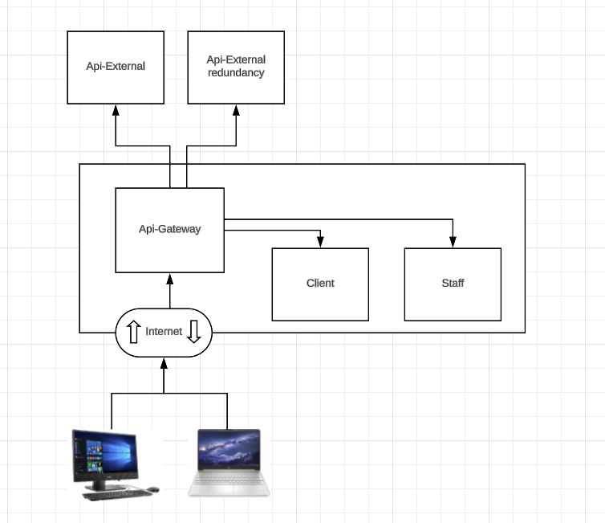

# Spring-Cloud-gateway

Project to demonstrate how implement api gateway of Spring boot.

## Tecnology

- maven
- java 22
- Spring framework
- Spring Cloud

## Architecture

- Api-gateway: project with spring cloud gateway.
- Cliente: project with spring web.
- Staff: project with spring web
- Api-External: Service with Cep of Brasil.
- Api-External: service with another api to get Brasil Cep.
